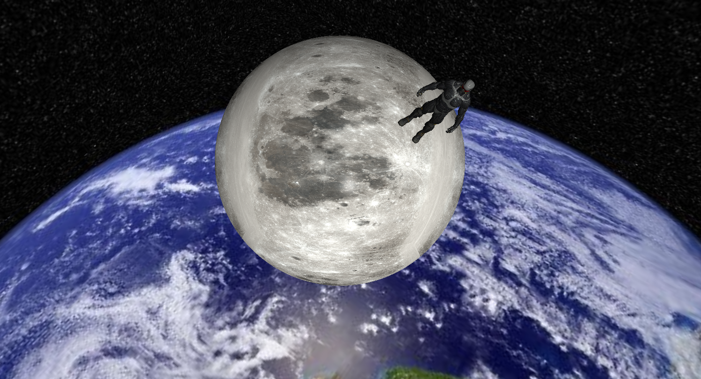

# Mikann Renderer Engine

Author : [LIU Fang]([Fang2896 (Fang LIU) (github.com)](https://github.com/Fang2896))

---

## Introduction

Mikann Renderer Engine is a OpenGL based renderer engine for rendering algorithm showcases.

## Features

### Basic Features

* [x] Camera Movement
* [x] Using `Assimp` load model
* [x] Skybox loading
* [ ] Scene Manger (using scene tree)
* [ ] Text Rendering

### Functions

* [x] Basic shapes
  (Cube, Sphere, Capsule, Plane, Quad and so on.)
* [x] Lighting and Objects transform configure system
* [x] Visualizing **Depth Buffer**
* [x] Using **Stencil Testing** to draw objects’ outlining
* [x] Transparent Object Rendering : Clipping and Blending 
  (draw a plane of grass and half transparent glass)
  * [x] Using Frame Buffer to renderer scene to a texture
    Then Post Processing: Inversion, Gray, Edging, Blur, Sharpen
* [ ] High level GLSL (half-side rendering etc.)
* [ ] Using Geometry shader to visualize normal
* [ ] Anti Aliasing
* [ ] Occlusion Culling and Frustum Culling

### Rendering Features

* [x] Blinn-Phong lighting 
* [x] Basic Transparency Rendering and Sort
* [ ] Reflection and Refraction shader
* [ ] Gamma Correction
* [ ] Shadow
* [ ] Normal Mapping and Displacement Mapping
* [ ] HDR
* [ ] Blooming
* [ ] SSAO
* [ ] Deferred shading
* [ ] PBR

## Bugs
1. 透明度物体选择轮廓问题
2. 物体轮廓的深度测试问题
3. 部分多材质模型（nanosuit）选择后轮廓不显现问题（仅物体增大）
4. 【已解决】部分多材质模式（nanosuit）仅显示一半的部分贴图问题
   * 原因及其解决方法: 
     部分模型的uv会超过1来重复利用对称材质，因此texture wrap mode应该设为repeat
5. 【已解决】改变剔除模式后，模型会变成全黑
   * 原因及其解决方法:
     原因未知。解决方法：每次绘制的时候重新传入Material。
6. 如果有两个透明物体位置一样，前面那个不会进行绘制
   * 原因及其解决方法:
     * 【部分解决】：原因是排序用`std::map`的键是dist，如果dist一样会被覆盖。
        部分解决方法:用vec进行排序。
     * 问题二: 这样还是会导致，如果新透明物体是在旧透明物体里面的话，
       新物体还是不能在外边看到（顺序问题）
7. 【已解决】即使按照教程用FrameBuffer，也没用。显示不出来PostProcessingScreen的Quad 
     * 解决方法:貌似在3.3以后的版本中，只用VBO是绘制不出来东西的，必须使用VAO.
       3.3之后的版本，强制使用VAO
8. 【已解决】后处理的材质与自己赋的材质有冲突。导致如果用了材质，后处理屏幕Quad只会用刚刚自己赋的材质， 而不是绑定的TextureBuffer
     * 解决方法: 绑定后处理Quad材质，draw完后需要解绑材质
9. 从后处理操作切换到正常的时候，物体会出现透视错误（UnitCube）

​    

## References

[1] [Learn OpenGL, extensive tutorial resource for learning Modern OpenGL](https://learnopengl.com/)

[2] [Fundamentals of Computer Graphics, Fourth Edition (darmajaya.ac.id)](http://repo.darmajaya.ac.id/4242/1/Fundamentals of Computer Graphics%2C Fourth Edition ( PDFDrive ).pdf)

[3] [Real-Time Rendering Resources (realtimerendering.com)](https://www.realtimerendering.com/)

[4] [GPU Gems](https://developer.nvidia.com/gpugems/gpugems/contributors)

